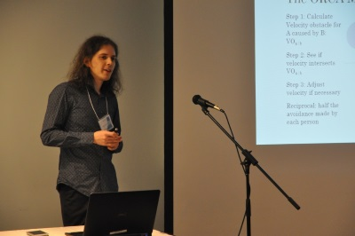

I'm John Charlton, a part time PhD student, part time Research Associate at the [University of Sheffield](https://www.sheffield.ac.uk), in the [Department of Computer Science](https://www.sheffield.ac.uk/dcs), in the [Visual Computing Group](https://www.sheffield.ac.uk/dcs/research/groups/visual-computing/home).

My supervisors are [Paul Richmond](http://paulrichmond.shef.ac.uk/) and [Steve Maddock](http://staffwww.dcs.shef.ac.uk/people/S.Maddock/index.shtml), and I work closely with [David Fletcher](https://www.sheffield.ac.uk/mecheng/people/academic/david-fletcher)

My focus is on fast and realistic simulations of dense pedestrian crowds. My research examines models and algorithms suitable for increasing accuracy and realism of crowds, while being ran in real-time. The advantage of real-time simulations is immediate visualisation and interactivity. User-input can affect the model and add imersion to enhance realism.

Graphical proccessing units (GPUs) are exelent hardware for use with pedestrian simulations. The effective compute throughput is theortically far higher in GPUs than CPUs. Since pedestrians follow similar rules and behaviours, there is a high degree of parallelism within models. This lends itself well to GPUs. The GPU is also used for visualisations. By having data computed on the GPU, results can be visualised with only minimal extra overhead. 

Being subject to real-time simulations, there must be a trade off between model complexity and number of simulated people. By increasing one, the other must decrease for simulation steps to remain constant. Use of GPUs allows for an increase in both model complexity and number of simulated people due to its high compute throughput.

I have examined the use of the ORCA model on GPUs, originally created by [van den Berg et. al](http://gamma.cs.unc.edu/ORCA/). It allows for millions of people to be simulated and visualised in real-time.

Current work is examining ways to increase realism and accuracy of dense crowds.

## RateSetter

As a research associate I am examining the Platform-Train Interface (PTI) within train stations. This has been particularly interesting during COVID times as social distancing  greatly changes the boarding and alighting behaviour of people. 

My work has involved creating a computer model of the PTI boarding-alighting process, validating it against CCTV from train stations, and then using the model to make predictions on how different parameters (e.g. platform layout, stock type) will affect this PTI process.

It has been really interesting to bring together two departments, computer science and mechanical engineering, to work on a joint topic. 