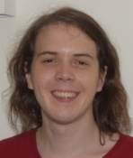

<!--  -->

I'm John Charlton, a Postdoctoral Research Fellow at the [University of Sheffield](https://www.sheffield.ac.uk), in [Neopath](https://www.neopath.org.uk/), part of the [School of Clinical Dentitry](https://www.sheffield.ac.uk/dentalschool)

My work is in the field of Computational Pathology, which seeks to utilise modern hardware advancements, developments in algorithms, and connect between different disciplines, to forward healthcare. I am specifically examining detections of head and neck cancers, with the aim of improving the detection and prognosis.

## Neopath

## PhD

I completed my PhD, as well as carried out 3 years of Research Associate work in the [Department of Computer Science](https://www.sheffield.ac.uk/dcs), in the [Visual Computing Group](https://www.sheffield.ac.uk/dcs/research/groups/visual-computing/home). Where my focus was of GPU computing, and simulating pedestrian crowds.

My PhD supervisors were [Paul Richmond](http://paulrichmond.shef.ac.uk/) and [Steve Maddock](http://staffwww.dcs.shef.ac.uk/people/S.Maddock/index.shtml), and I worked closely with [David Fletcher](https://www.sheffield.ac.uk/mecheng/people/academic/david-fletcher) in [Mechanical Engineering](https://www.sheffield.ac.uk/mecheng)

My focus is on fast and realistic simulations of dense pedestrian crowds. My research examines models and algorithms suitable for increasing accuracy and realism of crowds, while running in real-time. This is applied to practical areas such as train stations and platforms to help understand crowd dynamics and effects.

Graphical proccessing units (GPUs) are exelent hardware for use with pedestrian simulations. The effective compute throughput is theortically far higher in GPUs than CPUs. Since pedestrians follow similar rules and behaviours, there is a high degree of parallelism within models. The GPU is also used for visualisations, providing both computation and visualisation with only a fraction of additional overhead. 

Being subject to real-time simulations, there must be a trade off between model complexity and number of simulated people. By increasing one, the other must decrease for simulation steps to remain constant. Use of GPUs allows for an increase in both model complexity and number of simulated people due to its high compute throughput.

I have examined the use of the ORCA model on GPUs, originally created by [van den Berg et. al](http://gamma.cs.unc.edu/ORCA/). It allows for millions of people to be simulated and visualised in real-time. It is an exellent baseline steering model in which to build more complex designs.

My Viva took place around October 2023, and the thesis, titled "Constraint-Based Simulation of Virtual Crowds" is [available here](). The thesis explores a novel way of simulating people that uses mathematical constraints. The advantage of using constraints, compared to other methods, is that constraints can be easily combined together. This means that different rules, described as constraints, can easily be computed together, allowing for a flexible behaviour model. The thesis explores how the pedestrian model behaves, as well as its computational performance utilising GPUs.

## RateSetter

As a research associate I examined the Platform-Train Interface (PTI) within train stations. This is the region of the platform and train where people move to board and alight. It is of particular interest because this is the cause of largest variation in train services, and understanding it more fully can lead to further insights for everyone involved in travelling on trains.

I worked on RateSetter over three years, and during that time I worked on various projects regarding simulating the PTI process. The three projects were (and the year they commenced): 

- Predicting a new fleet of trains at Liverpool stations (2019)
- How the PTI process is affected by COVID (2020)
- Changes to the platform to help people move around (2021)

It has been really interesting to bring together two departments, computer science and mechanical engineering, to work on a joint topic. The exertise in the two areas come together to create complex, accurate models which can validate and predict future behaviour.

The best place to find more about how RateSetter works is from the initial paper ["Ratesetter: Roadmap for faster, safer, and better platform train interface design and operation using evolutionary optimisation"](https://dl.acm.org/doi/pdf/10.1145/3205455.3205605) and [my PhD thesis](), particularly chapter 4, on simulation model accuracy.

The following sections detail these RateSetter projects in more detail.

### Liverpool
RateSetter had already been tested on previous projects before I joined, and my first task was understanding how it worked, and what I could bring to enhance it.

The project was designed in three steps. First was to measure the PTI process at various stations in Liverpool using the current fleet of trains. Then to simulate and make predictions about how this should change with the new fleet of trains. Finally to measure the PTI process with the new trains, and examine how well the predictions lined up.

However, delays in rolling out the new trains by Merseyrail meant that much of the final parts of the project could not be carried out during the project timeline. RateSetter still had work to do, however, as the COVID-19 pandemic started up at this time.

### COVID
Studying the PTI has been particularly interesting during COVID times as social distancing greatly changed the boarding and alighting behaviour of people. New variable and parameters arose, such as the idea of different amounts of social distancing, as well as the existance of people who have their own rules for how they want to socially distance.

A sign close to Manchester Picadilly reminding people to stay apart
Copyright [David Dixon](https://www.geograph.org.uk/profile/43729) and licensed for [reuse](https://www.geograph.org.uk/reuse.php?id=6506326) under this [Creative Commons Licence](http://creativecommons.org/licenses/by-sa/2.0/)

This project was with [RSSB](https://www.rssb.co.uk/) and [Network Rail](https://www.networkrail.co.uk/) to provide guidance to Britain's railway authorities about how they should approach the PTI with the pandemic. Key factors of this work were: the rapid turn around of results; continual feedback and changes of the governing authorities; and people's changing behaviours throughout the pandemic.

My work involved studying CCTV footage of people at train station platforms and reasoning what sort of simplified rules could be written. These rules can then be translated to mathematical representation, in order to create virtual simulations that represent what people were really doing at the platform.

This work took place around the country from Manchester Picadilly to London's Blackfriars. Platform layout, train configuration, time of day, and many other factors were all considered when developing the simulation model.

The result was a powerful predicting simulation which could estimate how much longer a train needed to wait for people to board and alight due to COVID. This information was given to RSSB and Network Rail who then incorporated it into their nationwide information to station managers.

### Peckham Rye
[Peckahm Rye](https://osm.org/go/euuvD2Shr) is a London Tube station that suffers from high pedestrian congestion on its platform. This is in part due to the old Victorian engineering which has been difficult to modernise. The RateSetter team and I were tasked with figuring out what changes to the station layout would be best.

The initial process involved validating the simulation model against the particulars of Peckham Rye, including train layout, platform layout, as well as the statistical behaviours of the passengers (such as how fast they walk).

These two images show a satellite view Peckham Rye station, and its associated computer simulation. A lot of the details on the platform are covered by the platform roof.

This validated simulation of Peckham Rye then meant we could make predictions with high confidence. The results of different platform changes were explored, and the results were given to the station owners. The results of the different platform changes found in the simulation were weighed up against cost and practial constraints by the station owners. From my own perspective it felt like our findings were mostly discarded. I think because many of the layouts we found most promising were not all that practical to implement. 

In the end, I'm not entirely sure which route Peckham Rye will go. I hope one day, in a few years time once they have completed the construction works, to visit the station and see what changes they have made, and whether the insights I provided were taken into account, or just used to justify the idea already suggested before the start of the project.